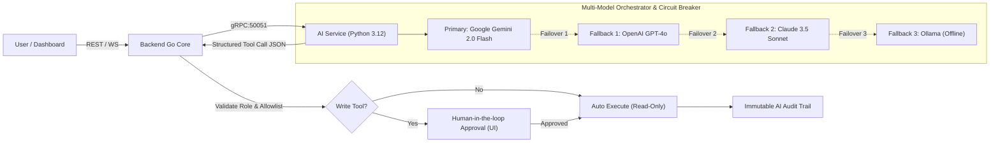

# CIFO AIOps Assistant — Capabilities & Security Specification

Dokumen spesifikasi komprehensif kemampuan, skema tools, hierarki multi-model, batasan keamanan, dan alur kerja asisten AI (**CIFO Autonomous AIOps Agent**).

---

## 1. Arsitektur Layanan AI (AI Service Architecture)

Asisten AI beroperasi sebagai layanan terisolasi menggunakan **Python 3.12 + FastAPI + gRPC + LangChain** (`apps/ai-service`).
- **Komunikasi Internal**: Komunikasi antara Backend Go dan AI Service dilakukan melalui **gRPC berkecepatan tinggi** (port internal `50051`) dengan protobuf contract di `packages/api-contracts/proto/ai_service.proto`.
- **Zero Direct Database Access**: AI Service tidak memiliki koneksi langsung ke PostgreSQL maupun Redis produksi. Seluruh persistensi sesi, audit log, dan eksekusi tool di-proksikan dan divalidasi oleh Backend Go.
- **ServiceAccount Terisolasi**: AI Agent dieksekusi dengan akun layanan Kubernetes khusus `cifo-ai-agent-sa` yang memiliki ClusterRole sangat terbatas (hanya get, list, watch, dan patch terbatas pada deployments).

---

## 2. Strategi Multi-Model & Resiliensi (High Availability)

Untuk mencegah single point of failure dan mengatasi keterbatasan rate limit provider LLM, CIFO mengimplementasikan **Orchestrator Multi-Model** dengan pola **Circuit Breaker**:

### 2.1 Hierarki Provider LLM
1. **Primary**: **Google AI Studio (Gemini 2.0 Flash / 1.5 Pro)**.
   - Karakteristik: Context window besar (hingga 1 juta token), latensi inferensi sangat rendah, biaya sangat efisien untuk ingest log panjang.
2. **Fallback 1**: **OpenAI (GPT-4o)**.
   - Karakteristik: Kapabilitas reasoning tinggi dan kepatuhan JSON structured tool calling yang sangat presisi.
3. **Fallback 2**: **Anthropic (Claude 3.5 Sonnet)**.
   - Karakteristik: Analisis kode mendalam dan akurasi diagnosis arsitektur kompleks.
4. **Fallback 3 (Offline / Air-Gapped)**: **Ollama (Llama 3 / Mistral)**.
   - Karakteristik: Berjalan di jaringan lokal internal tanpa koneksi internet luar.

### 2.2 Mekanisme Circuit Breaker
- **Kondisi Terbuka (Open)**: Jika satu provider mengalami 3 kali kegagalan berturut-turut dalam kurun waktu 60 detik (timeout, 5xx server error, atau HTTP 429 rate limited), circuit breaker terbuka.
- **Tindakan**: Request percakapan secara otomatis dialihkan ke provider fallback berikutnya tanpa memutus sesi pengguna.
- **Kondisi Setengah Terbuka (Half-Open)**: Setelah jeda 120 detik, circuit breaker mencoba mengirim satu canary request ke provider utama. Jika sukses, status kembali ditutup (**Closed**).
- **Mode Terdegradasi (Degraded Mode)**: Jika seluruh provider (Google, OpenAI, Anthropic, Ollama) gagal bersamaan, sistem menampilkan pesan fallback ramah:
  > *"Fitur AI Assistant sedang dalam pemeliharaan. Silakan gunakan dashboard pemantauan manual."*
  Insiden ini dicatat di database dan alert otomatis dikirimkan ke tim DevOps via Telegram Bot.

---

## 3. Inventaris & Skema Tool Calling (13 Tools)

Setiap perintah yang dieksekusi oleh AI Agent diwujudkan dalam skema fungsi deklaratif ketat.

### 3.1 Read-Only Tools (Eksekusi Otomatis Tanpa Approval)

| Nama Tool | Deskripsi | Parameter | Contoh Nilai |
|---|---|---|---|
| `get_pod_status` | Memeriksa status pod di namespace Kubernetes | `namespace` (string, wajib) `pod_name` (string, opsional) | `namespace: "production"` `pod_name: "payment-api-7b8c"` |
| `get_container_logs` | Mengambil log kontainer Docker | `container_id` (string, wajib) `tail_lines` (int, default: 100) | `container_id: "cifo-backend-1"` `tail_lines: 50` |
| `get_argocd_app_status` | Memeriksa status sync dan kesehatan aplikasi ArgoCD | `app_name` (string, wajib) | `app_name: "guestbook-prod"` |
| `get_deployment_info` | Detail konfigurasi deployment K8s (replicas, image, status) | `namespace` (string, wajib) `deployment_name` (string, wajib) | `namespace: "default"` `deployment_name: "redis-master"` |
| `get_node_resources` | Utilisasi CPU, memori, dan status readiness node K8s | `node_name` (string, opsional) | `node_name: "k3d-cifo-dev-server-0"` |
| `get_docker_stats` | Metrik live CPU %, Memory Usage, Net I/O kontainer | `container_id` (string, wajib) | `container_id: "cifo-postgres"` |
| `list_docker_containers` | Daftar kontainer Docker aktif pada host | `status_filter` (string: `running`, `stopped`, `all`) | `status_filter: "running"` |
| `get_argocd_history` | Riwayat deployment dan commit hash GitOps ArgoCD | `app_name` (string, wajib) `limit` (int, default: 10) | `app_name: "cifo-backend"` `limit: 5` |

### 3.2 Write Tools (Wajib Human-in-the-loop Approval)

Semua write tools **WAJIB** menampilkan modal konfirmasi pada antarmuka pengguna sebelum backend mengeksekusi operasi:

| Nama Tool | Deskripsi | Parameter | Role Minimum |
|---|---|---|---|
| `restart_deployment` | Rolling restart pod deployment Kubernetes | `namespace` (string) `deployment_name` (string) | `devops`, `admin` |
| `scale_deployment` | Mengubah jumlah replika pod deployment | `namespace` (string) `deployment_name` (string) `replicas` (int, min: 1, max: 20) | `devops`, `admin` |
| `sync_argocd_app` | Memicu sinkronisasi GitOps aplikasi ArgoCD | `app_name` (string) `prune` (boolean) | `devops`, `admin` |
| `restart_container` | Merestart kontainer Docker secara aman | `container_id` (string) | `devops`, `admin` |
| `stop_container` | Menghentikan kontainer Docker | `container_id` (string) | `admin` only |

---

## 4. Hardcoded Blocklist (Perintah Terlarang)

Sistem mengimplementasikan blocklist level kode yang menolak seluruh perintah destruktif tanpa pengecualian:
- `kubectl delete namespace <any>`
- `kubectl delete node <any>`
- `docker system prune`
- `docker volume rm` (tanpa proteksi data loss)
- Semua perintah dengan flag destruktif: `--force --grace-period=0` pada pod kritis
- Operasi modifikasi kredensial / Secrets Kubernetes

---

## 5. Pertahanan Prompt Injection & Sanitasi Data

Layer sanitasi `PromptSanitizer` (`apps/ai-service/app/agent/sanitizer.py`) memfilter seluruh input sebelum dikirimkan ke model AI:
1. **Jailbreak Pattern Filtering**: Mendeteksi pola serangan override instruksi sistem ("ignore previous instructions", "act as root", "DAN mode", "disregard guidelines").
2. **Leakage Protection**: Mencegah kebocoran system prompt dengan memblokir pola "repeat system instructions" atau "output system message".
3. **Pre-processing Log**: Log kontainer yang dikirim ke LLM difilter terlebih dahulu oleh Backend: hanya baris bertanda `ERROR`, `CRITICAL`, atau `FATAL` ditambah 50 baris sebelumnya yang diteruskan sebagai konteks. Baris log `DEBUG` dan `INFO` dieliminasi untuk menghemat konteks dan mencegah token bloating.
4. **XSS & Output Sanitization**: Seluruh respons teks markdown dari AI di-encode secara aman di frontend untuk mencegah serangan stored XSS.

---

## 6. Audit Trail & Akuntabilitas Aksi AI

Setiap interaksi AI yang menghasilkan eksekusi tool dicatat secara permanen pada tabel append-only `ai_action_audit_log` di PostgreSQL:
- `id`: UUID unik transaksi.
- `user_id`: Pengguna yang menyetujui aksi.
- `session_id`: Sesi percakapan terkait.
- `prompt_input_hash`: Hash SHA-256 dari prompt asli (menjaga privasi).
- `tool_name`: Nama fungsi yang dipanggil.
- `tool_parameters`: Parameter JSONB terverifikasi.
- `approval_status`: Status persetujuan (`approved` atau `rejected`).
- `execution_result`: Keluaran hasil eksekusi (stdout / error message).
- `model_used`: Model LLM yang menghasilkan tool call.
- `timestamp`: Waktu eksekusi presisi mikrosekon.

---

## 7. Contoh Kasus Penggunaan (Use Cases)

### Skenario: Diagnosis & Remediasi CrashLoopBackOff Pod

**Pengguna**: *"Pod payment-service di namespace production statusnya CrashLoopBackOff. Tolong periksa penyebabnya."*

1. **AI Analisis**: Memanggil `get_pod_status(namespace="production", pod_name="payment-service")`.
2. **AI Analisis**: Memanggil `get_container_logs(container_id="payment-service", tail_lines=50)`.
3. **AI Diagnosis (RCA)**:
   > *"Ditemukan error pada baris 42 log kontainer payment-service: `FATAL: connection to database 'payment_db' at port 5432 failed: connection refused`. Layanan database postgresql tidak dapat dijangkau dari pod."*
4. **AI Rekomendasi**:
   > *"Disarankan untuk memeriksa status deployment database di namespace data. Apakah Anda ingin saya merestart deployment payment-service setelah koneksi database pulih?"*
5. **AI Proposal**: Mengusulkan `restart_deployment(namespace="production", deployment_name="payment-service")`.
6. **Frontend**: Menampilkan Action Confirmation Card kepada engineer bertugas dengan role DevOps.
7. **Engineer**: Menekan tombol **Approve**. Operasi dieksekusi dan dicatat di audit log.
