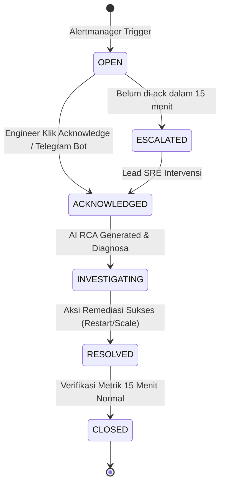

# CIFO Platform — Incident Response & Triage Runbook

Panduan penanganan insiden infrastruktur, eskalasi alert, mitigasi alert storm, dan Prosedur Operasional Standar (SOP) kegagalan sistem pada **CIFO Enterprise IT Monitoring & AIOps Platform**.

---

## 1. Klasifikasi Tingkat Keparahan (Severity Levels)

| Severity | Target Tanggapan | Target Resolusi | Dampak Bisnis | Saluran Notifikasi |
|---|---|---|---|---|
| **CRITICAL (P1)** | $< 5\text{ menit}$ | $< 30\text{ menit}$ | Layanan utama mati, downtime database, kegagalan sinkronisasi produksi, data corruption risk. | Telegram Bot (Urgent), In-App Persistent Toast, Push On-Call. |
| **WARNING (P2)** | $< 15\text{ menit}$ | $< 2\text{ jam}$ | Utilisasi resource $> 85\%$, 1 replika pod mati namun service masih up, AI fallback aktif. | Telegram Bot, In-App Auto-Dismiss Toast (10s). |
| **INFO (P3)** | $< 1\text{ jam}$ | $< 24\text{ jam}$ | Notifikasi deployment selesai, backup rutin sukses, rotasi token periodik. | In-App Notification Center saja. |

---

## 2. Alur Penanganan & Siklus Hidup Insiden (Incident Lifecycle)



### 2.1 Kebijakan Eskalasi 15-Menit (Unacknowledged Escalation)
Jika insiden bertingkat **CRITICAL** berada dalam status `OPEN` tanpa ada engineer yang melakukan `ACKNOWLEDGE` dalam kurun waktu **15 menit**:
1. Status otomatis berubah menjadi `ESCALATED`.
2. Backend mengirim ulang alert berprioritas tinggi ke Telegram group dengan tag `[ESCALATED - UNACKNOWLEDGED 15 MIN]`.
3. Notifikasi dikirimkan ke level manajemen teknis / Lead SRE on-call.

### 2.2 Penanganan Badai Alert (Alert Storm Mitigation)
Jika terjadi alert dalam frekuensi masif ($> 10$ alert dalam 60 detik akibat kegagalan berantai):
- **Deduplikasi & Batching**: Backend menahan alert terpisah dan menggabungkannya ke dalam 1 pesan ringkasan:
  > *"🚨 ALERT STORM DETECTED: 8 alerts triggered dalam 2 menit terakhir (5 PodCrashLooping, 2 ContainerCpuCritical, 1 ArgoCDSyncFailed). Kunjungi https://cifo.internal/incidents untuk daftar lengkap."*
- Hal ini mencegah terlewatinya informasi penting akibat rate limiting Telegram Bot API (30 pesan/menit).

---

## 3. Standard Operating Procedures (SOP) Skenario Kritis

### SOP-01: Penanganan `PodCrashLooping` & `ContainerOOMKilled`
- **Gejala**: Alert `PodCrashLooping` atau kontainer dihentikan dengan Exit Code `137` (Out Of Memory).
- **Prosedur**:
  1. Periksa log insiden pada halaman `/incidents/{id}` untuk melihat ringkasan Root Cause Analysis (RCA) AI.
  2. Buka dialog log pod di dashboard Kubernetes (`/kubernetes`) untuk melihat penyebab crash.
  3. Jika terbukti kehabisan memori, minta AI Assistant atau lakukan scale limit via Helm/Kubectl:
     ```bash
     kubectl patch deployment <name> -n <namespace> -p '{"spec":{"template":{"spec":{"containers":[{"name":"app","resources":{"limits":{"memory":"1Gi"}}}]}}}}'
     ```
  4. Jalankan rolling restart pod:
     ```bash
     kubectl rollout restart deployment <name> -n <namespace>
     ```
  5. Acknowledge dan masukkan catatan resolusi pada insiden.

### SOP-02: Penanganan `ArgoCDSyncFailed` & `ArgoCDAppDegraded`
- **Gejala**: Aplikasi GitOps berstatus `OutOfSync` atau `Degraded`.
- **Prosedur**:
  1. Buka halaman ArgoCD (`/argocd`).
  2. Klik aplikasi terkait dan periksa tab **Sync Status** untuk menemukan resource yang gagal apply (misalnya: benturan skema manifest atau CRD yang hilang).
  3. Jika kegagalan disebabkan oleh deployment hang, periksa event Kubernetes:
     ```bash
     kubectl get events -n <namespace> --sort-by='.metadata.creationTimestamp'
     ```
  4. Lakukan sinkronisasi ulang manual via UI atau API (`POST /api/v1/argocd/apps/{name}/sync`).

### SOP-03: Penanganan Database Connection Pool Exhaustion
- **Gejala**: Backend merespons error `500 Internal Server Error` dengan pesan `"acquire connection timeout: pool exhausted"`.
- **Prosedur**:
  1. Periksa jumlah koneksi aktif pada PostgreSQL:
     ```sql
     SELECT count(*), state FROM pg_stat_activity GROUP BY state;
     ```
  2. Identifikasi query lambat atau transaksi menggantung yang memblokir pool:
     ```sql
     SELECT pid, now() - pg_stat_activity.query_start AS duration, query 
     FROM pg_stat_activity 
     WHERE state != 'idle' ORDER BY duration DESC;
     ```
  3. Hentikan PID yang memblokir jika diperlukan: `SELECT pg_terminate_backend(<pid>);`.
  4. Periksa metrik koneksi backend di VictoriaMetrics/Grafana.

### SOP-04: Penanganan `AIServiceUnavailable` (Degraded Mode)
- **Gejala**: Alert `AIServiceUnavailable` aktif, chat AI menampilkan pesan pemeliharaan.
- **Prosedur**:
  1. Periksa log pod `cifo-ai-service`:
     ```bash
     kubectl logs -l app.kubernetes.io/component=ai-service -n cifo-production --tail=100
     ```
  2. Periksa apakah kunci API Google AI Studio / OpenAI di Vault kadaluarsa atau kuota token habis.
  3. Uji konektivitas gRPC dari backend:
     ```bash
     kubectl exec -it <cifo-backend-pod> -n cifo-production -- nc -zv cifo-ai-service 50051
     ```
  4. Jika provider eksternal mengalami gangguan global (outage), biarkan sistem beroperasi pada Degraded Mode sementara dashboard manual tetap melayani kebutuhan monitoring.

---

## 4. Matriks Kontak & Eskalasi Tim On-Call

| Peran | Saluran Kontak | Wewenang |
|---|---|---|
| **Primary SRE On-Call** | Telegram Group: `@cifo_sre_alerts`<br>Telepon: `+62-811-SRE-DUTY` | Triage awal, restart pod, scale deployment, sync ArgoCD. |
| **Secondary DevOps Lead** | Email: `devops-lead@cifo.internal`<br>Telepon Darurat: On-call phone | Pengambilan keputusan roll-back produksi, failover database. |
| **Security & Compliance** | Email: `security@cifo.internal` | Investigasi anomali akses, audit trail breach review. |
